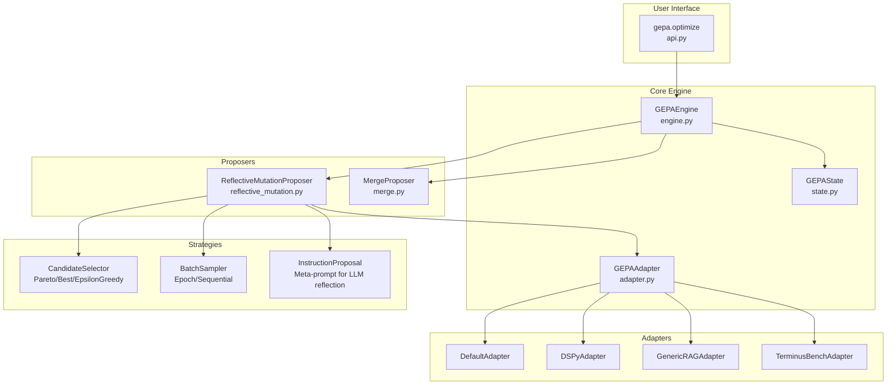
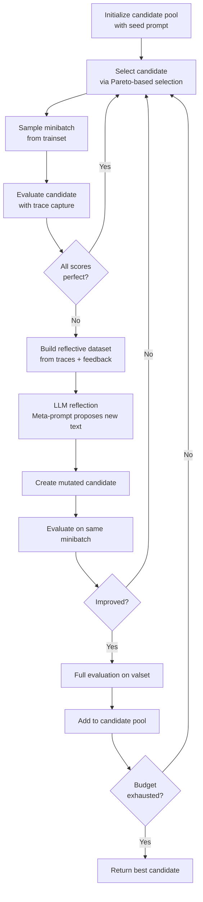

# GEPA Codebase Documentation

GEPA (Genetic-Pareto) is a reflective prompt evolution framework that uses natural language reflection and evolutionary search to optimize text components of AI systems, outperforming both RLHF/GRPO and traditional prompt optimizers like MIPROv2.

---

## High-Level Architecture



---

## Core Algorithm Flow

The GEPA optimization loop follows an evolutionary pattern with reflection-based mutation:



---

## Directory Structure

```
src/gepa/
├── api.py                    # Main entry point: gepa.optimize()
├── gepa_utils.py             # Utility functions
├── __init__.py
│
├── core/                     # Core abstractions
│   ├── adapter.py            # GEPAAdapter interface
│   ├── engine.py             # GEPAEngine orchestration
│   ├── state.py              # GEPAState candidate tracking
│   ├── data_loader.py        # DataLoader abstraction
│   └── result.py             # GEPAResult output
│
├── proposer/                 # Candidate proposal strategies
│   ├── base.py               # Base classes
│   ├── merge.py              # System-aware crossover
│   └── reflective_mutation/  # Core mutation via reflection
│       ├── base.py
│       └── reflective_mutation.py
│
├── strategies/               # Pluggable strategies
│   ├── candidate_selector.py # Pareto, BestScore, EpsilonGreedy
│   ├── batch_sampler.py      # Epoch shuffle, sequential
│   ├── component_selector.py # Round-robin, all
│   ├── eval_policy.py        # Full evaluation policy
│   └── instruction_proposal.py # Meta-prompt for reflection
│
├── adapters/                 # System integrations
│   ├── default_adapter/      # Single-turn LLM optimization
│   ├── dspy_adapter/         # DSPy integration
│   ├── dspy_full_program_adapter/  # Full DSPy program evolution
│   ├── generic_rag_adapter/  # Vector store-agnostic RAG
│   ├── terminal_bench_adapter/  # Terminal-use agent
│   └── anymaths_adapter/     # Math problem solving
│
├── examples/                 # Usage examples
│   ├── aime/                 # AIME math benchmark
│   ├── terminal-bench/       # Terminus agent
│   └── rag_adapter/          # RAG optimization
│
├── logging/                  # Logging infrastructure
└── utils/                    # Stopper protocols
```

---

## File-by-File Documentation

### Core Module

---

#### [api.py](file:///Users/sulaiman/Downloads/contrastive_verifier/gepa/src/gepa/api.py)

**Purpose**: Main entry point exposing `gepa.optimize()` function.

**Key Function**: `optimize()`

| Parameter | Description |
|-----------|-------------|
| `seed_candidate` | Initial prompt(s) as `dict[str, str]` |
| `trainset` | Training examples for minibatch sampling |
| `valset` | Validation set for Pareto evaluation |
| `task_lm` | Model being optimized (e.g., "openai/gpt-4.1-mini") |
| `reflection_lm` | Strong model for reflection (e.g., "openai/gpt-5") |
| `max_metric_calls` | Budget limit for evaluations |
| `adapter` | Optional custom `GEPAAdapter` |

**Returns**: `GEPAResult` with `best_candidate`, optimization history, and metrics.

---

#### [adapter.py](file:///Users/sulaiman/Downloads/contrastive_verifier/gepa/src/gepa/core/adapter.py)

**Purpose**: Defines the `GEPAAdapter` protocol—the integration interface between GEPA and any system.

**Key Classes**:

##### `EvaluationBatch`
Container for batch evaluation results:
- `outputs`: Per-example outputs from execution
- `scores`: Scalar scores (0-1)
- `trajectories`: Optional execution traces

##### `GEPAAdapter` (Protocol)
Required methods:
1. `evaluate(batch, candidate, capture_traces)` → Executes candidate on batch
2. `make_reflective_dataset(candidate, eval_batch, components_to_update)` → Builds reflection data

> [!IMPORTANT]
> Custom adapters must implement both methods to integrate with GEPA.

---

#### [engine.py](file:///Users/sulaiman/Downloads/contrastive_verifier/gepa/src/gepa/core/engine.py)

**Purpose**: `GEPAEngine` orchestrates the main optimization loop.

**Key Methods**:
- `run()` - Main loop: select → mutate → evaluate → add to pool
- `_evaluate_on_valset()` - Full Pareto evaluation
- `_get_pareto_front_programs()` - Get candidates on Pareto frontier
- `_run_full_eval_and_add()` - Evaluate new candidate on full valset

**Loop Logic**:
1. Initialize state with seed candidate
2. While budget remains:
   - Try reflective mutation
   - If improved on minibatch → full eval on valset
   - Periodically attempt merge (crossover)
3. Return best candidate

---

#### [state.py](file:///Users/sulaiman/Downloads/contrastive_verifier/gepa/src/gepa/core/state.py)

**Purpose**: `GEPAState` tracks all candidates, scores, and Pareto frontier.

**Key Attributes**:
- `program_candidates: list[dict[str, str]]` - All candidate prompts
- `program_full_scores_val_set: list[float]` - Aggregate scores
- `program_at_pareto_front_valset: dict[DataId, tuple[ProgramIdx, float]]` - Pareto frontier
- `parent_program_for_candidate: list[list[int|None]]` - Ancestry tree
- `total_num_evals: int` - Budget tracking

**Methods**:
- `update_state_with_new_program()` - Add candidate and update Pareto front
- `save()` / `load()` - Checkpoint management
- `is_consistent()` - Validation

---

### Proposer Module

---

#### [reflective_mutation.py](file:///Users/sulaiman/Downloads/contrastive_verifier/gepa/src/gepa/proposer/reflective_mutation/reflective_mutation.py)

**Purpose**: Core mutation mechanism using LLM reflection.

**Class**: `ReflectiveMutationProposer`

**Workflow**:
```python
def propose(self, state):
    # 1. Select candidate via Pareto selector
    curr_prog_id = self.candidate_selector.select_candidate_idx(state)
    
    # 2. Sample minibatch
    minibatch = self.trainset.fetch(subsample_ids)
    
    # 3. Evaluate with trace capture
    eval_curr = self.adapter.evaluate(minibatch, curr_prog, capture_traces=True)
    
    # 4. Build reflective dataset
    reflective_dataset = self.adapter.make_reflective_dataset(...)
    
    # 5. Propose new texts via LLM reflection
    new_texts = self.propose_new_texts(curr_prog, reflective_dataset, components)
    
    # 6. Evaluate mutated candidate
    eval_new = self.adapter.evaluate(minibatch, new_candidate)
    
    return CandidateProposal(...)
```

---

#### [merge.py](file:///Users/sulaiman/Downloads/contrastive_verifier/gepa/src/gepa/proposer/merge.py)

**Purpose**: System-aware crossover combining complementary lineages.

**Class**: `MergeProposer`

**Algorithm** (from paper Appendix F):
1. Find two candidates (i, j) on Pareto front with common ancestor (a)
2. For each module:
   - If prompt differs from ancestor in one descendant but not other
   - Take the evolved prompt from the differing descendant
3. Evaluate merged candidate

**Key Functions**:
- `find_common_ancestor_pair()` - Traverses ancestry tree
- `does_triplet_have_desirable_predictors()` - Checks merge criteria
- `sample_and_attempt_merge_programs_by_common_predictors()` - Executes merge

---

### Strategies Module

---

#### [candidate_selector.py](file:///Users/sulaiman/Downloads/contrastive_verifier/gepa/src/gepa/strategies/candidate_selector.py)

**Purpose**: Candidate selection strategies balancing exploration/exploitation.

| Class | Strategy |
|-------|----------|
| `ParetoCandidateSelector` | Sample from Pareto front weighted by winning instances |
| `CurrentBestCandidateSelector` | Always select highest-scoring candidate |
| `EpsilonGreedyCandidateSelector` | ε-greedy: random with prob ε, else best |

> [!TIP]
> Pareto selection is crucial—ablation shows 8.17% improvement over best-only selection.

---

#### [instruction_proposal.py](file:///Users/sulaiman/Downloads/contrastive_verifier/gepa/src/gepa/strategies/instruction_proposal.py)

**Purpose**: Meta-prompt for LLM-based reflection on execution traces.

**Default Meta-Prompt**:
```
I provided an assistant with the following instructions to perform a task for me:
```
<curr_instructions>
```

The following are examples of different task inputs provided to the assistant along 
with the assistant's response for each of them, and some feedback on how the 
assistant's response could be better:
```
<inputs_outputs_feedback>
```

Your task is to write a new instruction for the assistant.

Read the inputs carefully and identify the input format and infer detailed task 
description about the task I wish to solve with the assistant.

Read all the assistant responses and the corresponding feedback. Identify all 
niche and domain specific factual information about the task and include it in 
the instruction, as a lot of it may not be available to the assistant in the 
future. The assistant may have utilized a generalizable strategy to solve the 
task, if so, include that in the instruction as well.

Provide the new instructions within ``` blocks.
```

---

#### [batch_sampler.py](file:///Users/sulaiman/Downloads/contrastive_verifier/gepa/src/gepa/strategies/batch_sampler.py)

**Purpose**: Minibatch sampling strategies for reflection.

| Class | Strategy |
|-------|----------|
| `EpochShuffleBatchSampler` | Shuffle and sample without replacement per epoch |
| `SequentialBatchSampler` | Sequential iteration through dataset |

---

### Adapters

---

#### [default_adapter.py](file:///Users/sulaiman/Downloads/contrastive_verifier/gepa/src/gepa/adapters/default_adapter/default_adapter.py)

**Purpose**: Simple single-turn LLM optimization for system prompts.

**Data Types**:
```python
class DefaultDataInst(TypedDict):
    input: str                     # User message
    additional_context: dict       # Extra context for feedback
    answer: str                    # Expected answer

class DefaultTrajectory(TypedDict):
    data: DefaultDataInst
    full_assistant_response: str   # Model output
```

**Key Methods**:
- `evaluate()` - Runs LiteLLM batch completion, scores 1.0 if answer in response
- `make_reflective_dataset()` - Builds feedback: "correct" or "incorrect with context"

---

#### Other Adapters

| Adapter | Purpose |
|---------|---------|
| `dspy_adapter/` | DSPy module integration |
| `dspy_full_program_adapter/` | Evolve complete DSPy programs with signatures/modules |
| `generic_rag_adapter/` | Vector store-agnostic RAG (ChromaDB, Weaviate, Qdrant, Pinecone) |
| `terminal_bench_adapter/` | Terminus terminal-use agent optimization |
| `anymaths_adapter/` | Math problem-solving tasks |

---

## Key Design Decisions

> [!NOTE]
> **Reflective vs Scalar Feedback**: GEPA uses natural language traces instead of sparse scalar rewards. The reflection LLM can identify *why* solutions failed and propose targeted improvements.

> [!TIP]
> **Pareto Selection**: Instead of greedy best-candidate selection, GEPA maintains diverse candidates that excel on different validation subsets. This prevents local optima.

> [!IMPORTANT]
> **Budget Efficiency**: GEPA achieves GRPO's performance with up to **78x fewer rollouts** by leveraging rich textual feedback.

> [!WARNING]
> **Merge Conditions**: System-aware crossover only occurs when candidates have diverged from a common ancestor in different modules—otherwise merged prompts would be identical.

---

## Execution Flow Example

```python
import gepa

# 1. Define seed prompt
seed_prompt = {
    "system_prompt": "You are a helpful math assistant. Answer with \\boxed{answer}."
}

# 2. Prepare datasets
trainset = [{"input": "What is 2+2?", "answer": "4", "additional_context": {}}]
valset = [{"input": "What is 3+3?", "answer": "6", "additional_context": {}}]

# 3. Run optimization
result = gepa.optimize(
    seed_candidate=seed_prompt,
    trainset=trainset,
    valset=valset,
    task_lm="openai/gpt-4.1-mini",
    reflection_lm="openai/gpt-5",
    max_metric_calls=150,
)

# 4. Access result
print(result.best_candidate["system_prompt"])
```

---

## Paper Results Summary

| Comparison | GEPA Improvement |
|------------|------------------|
| vs GRPO (RL) | Up to **+20%** with **35x fewer** rollouts |
| vs MIPROv2 | Up to **+11.1%** |
| Pareto vs Best-only | **+8.17%** (ablation) |
| Prompt length | Up to **9.2x shorter** than few-shot prompts |

---

## References

- **Paper**: [GEPA: Reflective Prompt Evolution Can Outperform Reinforcement Learning](https://arxiv.org/abs/2507.19457)
- **DSPy Integration**: [dspy.GEPA Tutorials](https://dspy.ai/tutorials/gepa_ai_program/)
- **Reproduction Artifact**: [gepa-ai/gepa-artifact](https://github.com/gepa-ai/gepa-artifact)
